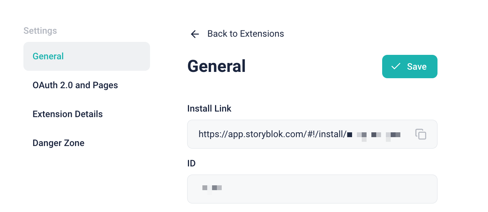

# `space-plugin-nuxt-starter`

This Nuxt starter is a Storyblok Space Plugin that includes the basic authentication flow.

## Tutorial Video

If you prefer video tutorials over text, this is for you:

https://www.loom.com/share/f56defc5bfcf4fa8bce8682386f8352b?sid=8820f1b2-4229-4b05-9f22-4855e6dfccc5

## Getting Started

```sh
npx giget@latest gh:storyblok/space-tool-plugins/space-plugins/nuxt-starter YOUR-PROJECT-NAME
```

This repository is developed using [pnpm](https://pnpm.io/). However, you can also use Yarn or NPM.

```sh
cd YOUR-PROJECT-NAME

pnpm install && pnpm dev
# or
yarn install && yarn dev
# or
npm install && npm run dev
```

## Configuration

You need to create a Storyblok extension that will provide you with OAuth credentials. Then, you should add this information to your `.env` file and your hosting platform.

1. You can find the "Extensions" menu under either the Partner Portal or the My Organization.


2. Click the "New Extension" button in the top right corner and enter the necessary information.


And then you can find the information.


3. Configure the following environment variables in `<ROOT-OF-YOUR-PROJECT>/.env`.

- `CLIENT_ID=`: Client Identifer
- `CLIENT_SECRET=`: Client Secret
- `BASE_URL=`: When using this starter, you should expose your local development server. To do this, we suggest using services like [ngrok](https://ngrok.com/). Let's say your hostname is `https://PUT-YOURS.ngrok.io`. Set that as your `BASE_URL`.

> [!NOTE]
> ngrok offers a static domain on the free plan, so you don't have to update the BASE_URL in your `.env` and Storyblok every time you get a new domain while using ngrok CLI.


4. Configure your extension on Storyblok with the index URL and the redirection URL. The redirection URL ends with `/api/connect/callback`.


Ensure that "Production" is the section that contains information about the production deployment, while "Preview" refers to your development environment, such as exposing localhost through ngrok.

5. App Bridge is an extra authentication layer recently introduced for Space Plugins and Tool Plugins. This starter assumes you've enabled App Bridge on the Settings page. Documentation on App Bridge will come in the near future, but you don't need to know about its inner process. This starter takes care of it out-of-the-box.


If you don't see the UI to enable App Bridge, please reach out to [the Storyblok support](https://www.storyblok.com/trust-center/service-support). Or, you can disable App Bridge, by replacing your `app.config.ts` with the following.

```ts
export default defineAppConfig({
	appBridge: {
		type: 'space-plugin',
		enabled: false,
		oauth: true,
		origin: 'https://app.storyblok.com',
	},
});
```

6. Open the "Install Link" in a new tab and install it in your space for the development and test.



7. Start developing by running `yarn dev`, and open it on Storyblok.


> [!NOTE]
> If the authentication flow isn't working, please check if you have an ad blocker extension enabled in your browser and disable it.

8. Deployment

You should configure the same environment variables on the hosting platform as well.
