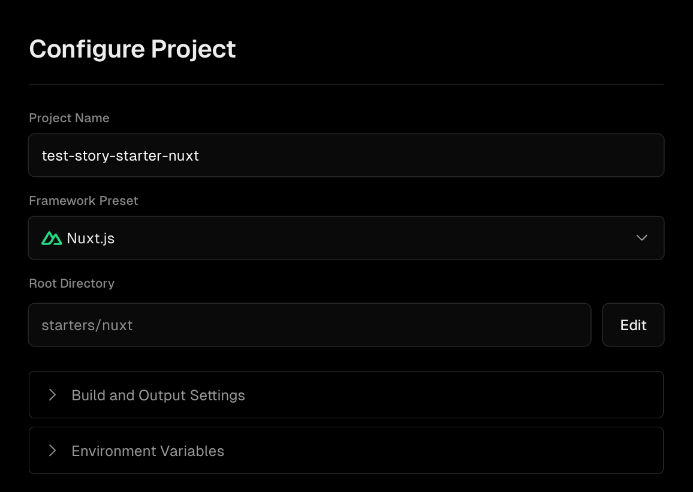

# Story Starter

The Story Starter is a [Space Plugin](https://www.storyblok.com/docs/plugins/custom-application) template that appears on the sidebar of your Storyblok space. It offers essential features for retrieving stories, enabling users to select specific ones, and performing actions. You can implement the actions you want to perform in `stories.config.ts`.

## Getting Started

> [!NOTE]
> Currently, the Story Starter is written only in Nuxt. However, please inform us if you would like to have a Next.js version. Feel free to create a GitHub issue to make the request.

```sh
npx giget@latest gh:storyblok/space-tool-plugins/space-plugins/story-starter YOUR-PROJECT-NAME
```

To learn more about the configuration, read the [space-plugin-nuxt-starter's README](https://github.com/storyblok/space-tool-plugins/blob/main/space-plugin-nuxt-starter/README.md#configuration).

## Customization

Open the `starters/nuxt/stories.config.ts` file and implement your own actions. You can refer to the existing sample implementation for guidance.

## Deployment

The Story Starter is set up as a monorepo, and most hosting platforms support it seamlessly. For instance, Vercel recognizes it as a Nuxt project and automatically configures the root directory for you.


