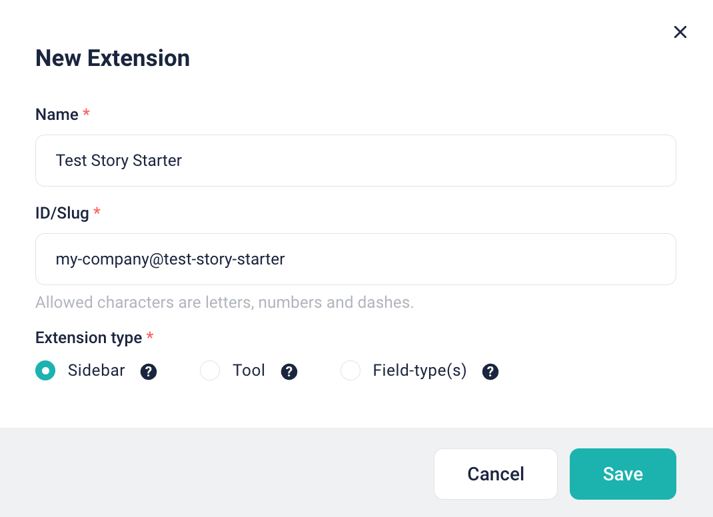
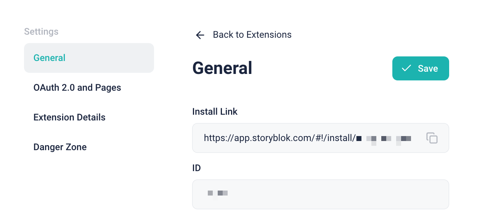
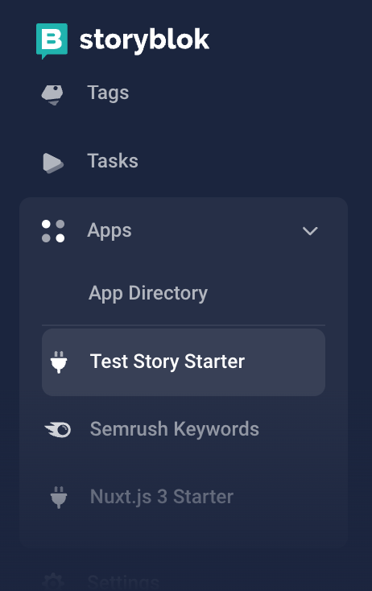
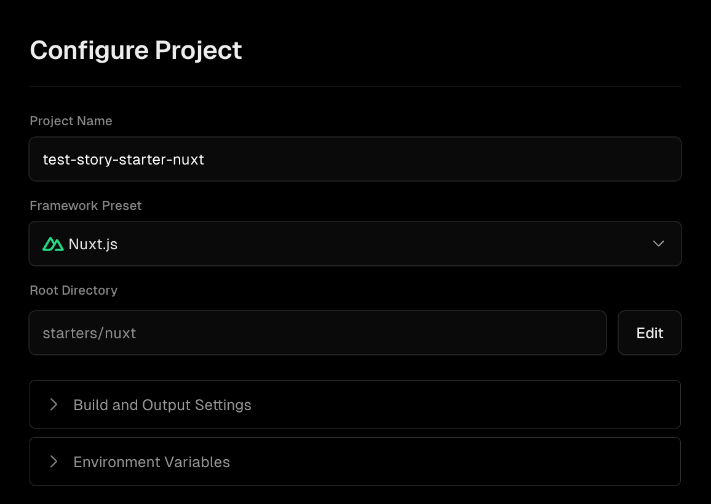

# Story Starter

The Story Starter is a [Space Plugin](https://www.storyblok.com/docs/plugins/custom-application) template that appears on the sidebar of your Storyblok space. It offers essential features for retrieving stories, enabling users to select specific ones, and performing actions. You can implement the actions you want to perform in `stories.config.ts`.

## Getting Started

> [!NOTE]
> Currently, the Story Starter is written only in Nuxt. However, please inform us if you would like to have a Next.js version. Feel free to create a GitHub issue to make the request.

```sh
npx giget@latest gh:storyblok/space-tool-plugins/story-starter YOUR-PROJECT-NAME
```

This repository is developed using [pnpm](https://pnpm.io/). However, you can also use Yarn or NPM.

```sh
cd YOUR-PROJECT-NAME

pnpm install && pnpm run dev:nuxt
# or
yarn install && yarn run dev:nuxt
# or
npm install && npm run dev:nuxt
```

## Configuration

You need to create a Storyblok extension that will provide you with OAuth credentials. Then, you should add this information to your `.env` file and your hosting platform.

1. You can find the "Extensions" menu under either the Partner Portal or the My Organization.


2. Click the "New Extension" button in the top right corner and enter the necessary information.



And then you can find the information.


3. Configure the following environment variables in `<ROOT-OF-YOUR-PROJECT>/starters/nuxt/.env`.

- `CLIENT_ID=`: Client Identifer
- `CLIENT_SECRET=`: Client Secret
- `BASE_URL=`: When using this starter, you should expose your local development server. To do this, we suggest using services like [ngrok](https://ngrok.com/). Let's say your hostname is `https://PUT-YOURS.ngrok.io`. Set that as your `BASE_URL`.

4. Configure your extension on Storyblok with the index URL and the redirection URL. The redirection URL ends with `/api/connect/callback`.


Ensure that "Production" is the section that contains information about the production deployment, while "Preview" refers to your development environment, such as exposing localhost through ngrok.

5. Open the "Install Link" in a new tab and install it in your space for the development and test.



6. Start developing by running `yarn dev:nuxt`, and open it on Storyblok.



7. Open the `starters/nuxt/stories.config.ts` file and implement your own actions. You can refer to the existing sample implementation for guidance.

8. Deploying

The starter is set up as a monorepo, and most hosting platforms support it seamlessly. For instance, Vercel recognizes it as a Nuxt project and automatically configures the root directory for you.



You should configure the same environment variables on the hosting platform as well.
