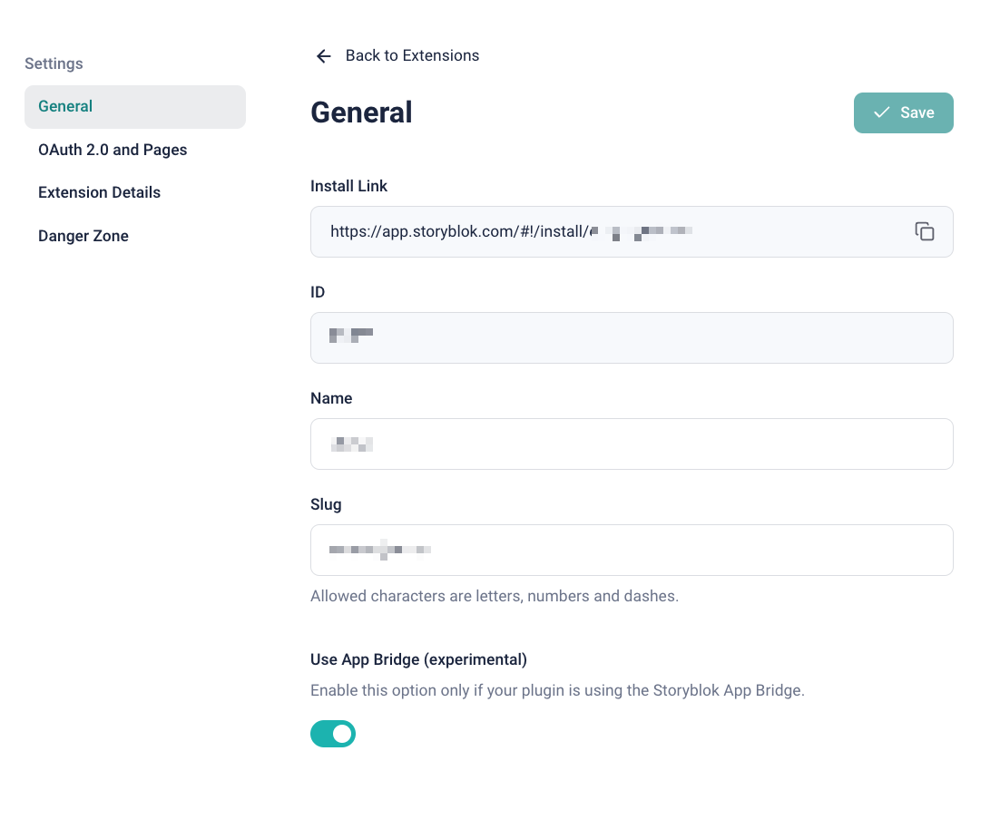
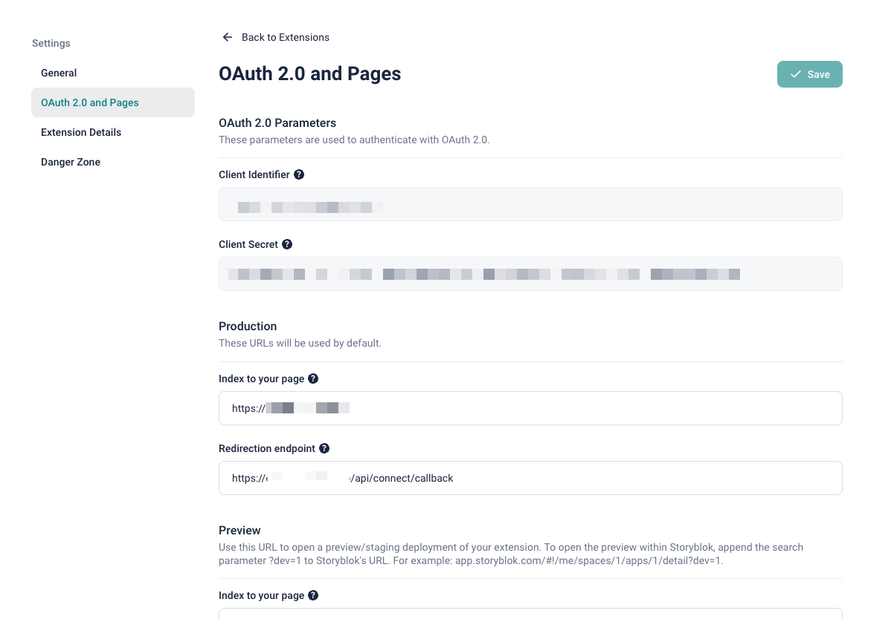

# Storyblok Tool Starter x Next.js

This is a starter template for Storyblok tools, created with Next.js (Pages Router) and [@storyblok/app-extension-auth](https://github.com/storyblok/app-extension-auth).

## Getting Started

```shell
npx giget@latest gh:storyblok/space-tool-plugins/tool-plugins/nextjs-starter YOUR-PROJECT-NAME
```

## How to run

Navigate to your project folder and install dependencies by running:

```shell
cd YOUR-PROJECT-NAME

yarn install # pnpm install or npm install
```

Set up a secure tunnel to proxy your request to/from `localhost:3000`, for example, with [ngrok](https://ngrok.com/):

```shell
ngrok http 3000
```

Note down your assigned URL; this will be your `baseUrl` for the application.

### Create a new Storyblok Extension

There are two ways on how you can create a tool inside Storyblok. Depending on your plan and use case, choose one of the following options:

#### Partner Portal

1. Open [Storyblok's Partner Portal Extension View](https://app.storyblok.com/#/partner/apps)
2. Click On **New Extension**
3. Fill in the fields `name` and `slug`
4. Select `tool` as extension type
5. Click on **Save**

#### Organization

1. Open [Storyblok's Organization Extension View](https://app.storyblok.com/#/me/org/apps)
2. Click On **New Extension**
3. Fill in the fields `name` and `slug`
4. Select `tool` as extension type
5. Click on **Save**

### Configuration

Once the tool has been created, a new entry will appear inside the extension list. Open it and navigate to the `OAuth 2.0 and Pages` tab.

Configure the following properties based on the previous steps:

- **Index to your page**: `{baseUrl}`
- **Redirection endpoint**: `{baseUrl}/api/connect/callback`

### Configure Starter Environment Variables

Rename the file `.env.local.example` to `.env.local`. Open the file and set the environmental variables:

- `CLIENT_ID`: the client ID from the tool's settings page.
- `CLIENT_SECRET`: the client secret from the tool's settings page.
- `BASE_URL`: The `baseUrl` from your secure tunnel.
- `NEXT_PUBLIC_TOOL_ID` is the slug from the tool's settings page.

Start the application by running:

```shell
yarn dev # pnpm dev or npm run dev
```

### App Bridge

App Bridge is an extra authentication layer recently introduced for Space Plugins and Tool Plugins. This starter assumes you've enabled App Bridge on the Settings page. Documentation on App Bridge will come in the near future, but you don't need to know about its inner process. This starter addresses a large portion of this aspect out of the box.



If you don't want to use App Bridge, you can use [the legacy template](https://github.com/storyblok/custom-app-examples/tree/main/app-nextjs-starter).

### App Bridge in Depth

App Bridge authentication starts on the frontend by sending a postMessage to `app.storyblok.com`. In the `src/pages/index.tsx` file, you can find the following code:

```jsx
const { completed } = useAppBridge({ type: 'space-plugin', oauth: true });

return (
	<div>
		{completed && (
			<div>
				<UserInfo />
				<Example />
			</div>
		)}
	</div>
);
```

The code above handles both App Bridge authentication and OAuth.

1. If you need to use Storyblok's Management API:

After completing both authentications, the `<UserInfo />` component is rendered. This component sends a request to `/api/user_info`. The OAuth token is automatically included in the request as a cookie, and the endpoint retrieves the session using `await getAppSession(req, res)`. It then fetches user information from Storyblok's Management API using the OAuth token.

2. If you don't need the Management API but still want to validate the request on the backend:

When the `<Example />` component is rendered, it makes a request to `/api/example`. We attach the App Bridge token as a header. The endpoint verifies the token using `await verifyAppBridgeHeader(req)`. Only if the token is verified can you perform any desired action.

### Tool Installation

Finally, install the application to your space:

1. Navigate to the tool's settings page.
2. Open the **General Tab**.
3. Open the **Install Link** in a new browser tab.
4. Select a space the Tool Plugin should be installed to.
5. Open the selected space from Step 4.
6. Navigate to a story of your choice.
7. Open the tool tab by clicking 
8. Approve the necessary access for the tool.

The installation process is only done once per space. After the installation is finished, you will be able to navigate to the tool section inside any story and access the Tool Plugin.

## Production

When deploying your Tool Plugin, please remember to adjust the tool settings inside the Storyblok App to point to the correct **Index to your page** and **Redirection endpoint**.

## Read More

For more detailed information on Storyblok extensions, read the following guides:

- [Tool Plugins](https://www.storyblok.com/docs/plugins/tool)
- [OAuth 2.0 Authorization Flow](https://www.storyblok.com/docs/plugins/authentication-apps)

## Troubleshooting

If you have trouble setting up the development environment, please review the following:

1. Ensure that the `.env.local` file is correctly set up with the following variables:

   - `CLIENT_ID=`
   - `CLIENT_SECRET=`
   - `BASE_URL=`

2. Ensure that the tunnel is correctly set up with the `BASE_URL`.

3. Ensure that the extension settings inside Storyblok are correctly set up with the following properties:
   - **Index to your page**: `{BASE_URL}`
   - **Redirection endpoint**: `{BASE_URL}/api/connect/callback`



4. Ensure that the extension settings inside Storyblok have the "Use App Bridge" option enabled.


5. Ensure that the ad-blocker browser extensions are disabled when developing the extension.
